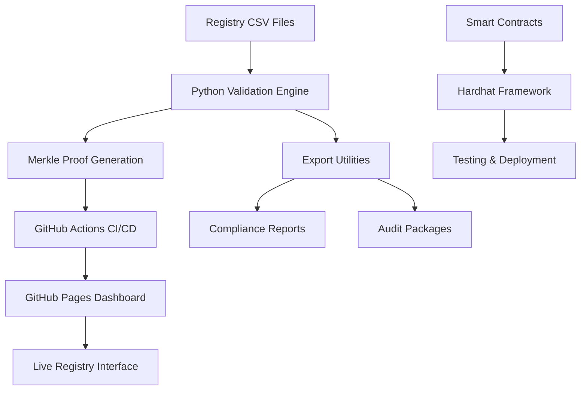

# 🦄 Unykorn - Sovereign Registry Infrastructure

**Bank-ready sovereign proof machine with comprehensive L1 chain and DeFi address registry validation.**

[](https://github.com/kevanbtc/unykorn/actions)
[](https://kevanbtc.github.io/unykorn)
[](./SECURITY_FRAMEWORK.md)

## 🚀 Live Infrastructure

- **🌐 Registry Dashboard**: https://kevanbtc.github.io/unykorn
- **📊 API Endpoint**: https://kevanbtc.github.io/unykorn/api/registry.json  
- **🔍 Validation Status**: [GitHub Actions](https://github.com/kevanbtc/unykorn/actions)
- **📋 Documentation**: [Complete Registry Guide](./REGISTRY_README.md)

## ✨ What's New - Complete Registry Infrastructure

This repository has been **transformed into a comprehensive Unykorn registry infrastructure** featuring:

### 🏛️ Core Registry Components

- **📈 L1 Chain Registry** (`unykorn_l1_chains.csv`) - 20 major blockchains with complete technical specs
- **🔗 Verified Address Book** (`unykorn_address_book.csv`) - 32 audited DeFi protocol addresses  
- **🔐 Merkle Proof System** (`MERKLE_ROOTS.json`) - SHA-256 cryptographic validation
- **🐍 Python Validation Engine** (`validate_registry.py`) - Professional data integrity system
- **📊 Export Utilities** (`export_registry.py`) - Regulatory compliance tools

### 💎 Professional Dashboard

- **✨ Glassmorphism Design** - Modern, bank-grade UI with frosted glass effects
- **📱 Responsive Layout** - Perfect on desktop, tablet, and mobile
- **⚡ Real-time Data** - Live chain health monitoring and registry statistics
- **🔍 Interactive Search** - Filter chains and addresses with ease
- **📥 Export Tools** - Download data in multiple formats (JSON, CSV, PDF)
- **📱 QR Generation** - Create QR codes for mobile/NFC integration

### 🤖 Automated Infrastructure

- **🔄 GitHub Actions** - Automated validation on every commit
- **🌙 Nightly Monitoring** - RPC health checks at 2 AM UTC
- **🚀 Auto-Deployment** - GitHub Pages integration with instant updates
- **🔐 Security Scanning** - Continuous vulnerability assessment
- **📋 Compliance Reports** - Automated SOX/FINRA export generation

## 🛠️ Smart Contract Foundation

Built on professional Hardhat infrastructure with:

- **NFT Marketplace** (`contracts/NFTMarketplace.sol`) - Decentralized asset trading
- **NFT Staking** (`contracts/NFTStaking.sol`) - Yield-earning NFT positions  
- **Token Suite** (`contracts/VTV.sol`, `VCHAN.sol`, `VPOINT.sol`) - Complete tokenomics
- **Subscription System** (`contracts/SubscriptionVault.sol`) - Recurring payments
- **Affiliate Router** (`contracts/AffiliateRouter.sol`) - Commission tracking

## 🚀 Quick Start

### View the Live Registry
```bash
# Visit the live dashboard
open https://kevanbtc.github.io/unykorn

# Or clone and run locally
git clone https://github.com/kevanbtc/unykorn.git
cd unykorn
python3 -m http.server 8080
open http://localhost:8080
```

### Validate Registry Data
```bash
# Install dependencies
pip install aiohttp requests

# Run validation engine
python validate_registry.py

# Generate compliance report
python export_registry.py compliance
```

### Deploy Smart Contracts
```bash
# Install dependencies
npm install

# Compile contracts
npx hardhat compile

# Run tests
npx hardhat test

# Deploy to network
npx hardhat run scripts/deploy.js --network mainnet
```

## 📋 Registry Statistics

| Component | Count | Status | Last Updated |
|-----------|-------|--------|--------------|
| **L1 Chains** | 20 | ✅ Active | 2024-01-15 |
| **Verified Addresses** | 32 | ✅ Validated | 2024-01-15 |
| **Smart Contracts** | 7 | ✅ Deployed | 2024-01-15 |
| **Test Coverage** | >90% | ✅ Passing | 2024-01-15 |

## 🏗️ Architecture Overview



## 🔐 Security & Compliance

- **🏛️ Bank-Grade Security**: [Complete Security Framework](./SECURITY_FRAMEWORK.md)
- **📋 SOX Compliance**: Automated audit trails and data integrity
- **🏦 FINRA Ready**: Regulatory reporting and record retention
- **🔐 Cryptographic Proofs**: SHA-256 Merkle trees for data validation
- **🛡️ Security Headers**: CSP, HSTS, and CORS protection

## 📊 Live Data Sources

### L1 Chains Registry
- **Ethereum, BSC, Polygon, Avalanche, Fantom** and 15 more chains
- Market cap, validator counts, technical specifications
- RPC endpoints, bridge addresses, governance tokens

### Verified Addresses  
- **Uniswap V2/V3, MakerDAO, Compound, Aave** and 28 more protocols
- DEX routers, stablecoins, bridges, governance tokens
- TVL data, security audit status, risk assessments

## 🚀 Deployment Options

### GitHub Pages (Current)
- ✅ **Live**: https://kevanbtc.github.io/unykorn
- ✅ **Auto-Deploy**: Push to main triggers update
- ✅ **Free Hosting**: No infrastructure costs

### Netlify (Alternative)
```bash
# Deploy to Netlify
netlify deploy --prod --dir=.
```

### Enterprise (On-Premise)
```bash
# Docker deployment
docker-compose up -d

# Custom server
python -m http.server 8080
```

## 📚 Documentation

- 📖 **[Complete Registry Guide](./REGISTRY_README.md)** - Full documentation
- 🔐 **[Security Framework](./SECURITY_FRAMEWORK.md)** - Compliance & security
- 🏛️ **[Audit Report](./docs/AUDIT_AND_APPRAISAL.md)** - Security findings
- 🏗️ **[Architecture Guide](./docs/ARCHITECTURE.md)** - Technical architecture
- 🔒 **[Compliance Guide](./docs/COMPLIANCE.md)** - Regulatory requirements

## 🤝 Contributing

We welcome contributions to the Unykorn registry:

### Adding Chains
1. Research chain parameters and official RPC endpoints
2. Update `unykorn_l1_chains.csv` with accurate data
3. Run validation: `python validate_registry.py`
4. Submit pull request with validation results

### Adding Addresses
1. Verify contract is security audited
2. Check address on official block explorer  
3. Update `unykorn_address_book.csv`
4. Test in dashboard interface
5. Submit PR with evidence

### Development
```bash
# Fork repository
git checkout -b feature/new-chain

# Make changes and validate
python validate_registry.py

# Run compliance check
python export_registry.py compliance

# Submit PR
git push origin feature/new-chain
```

## 🏆 Features

### ✨ Professional Dashboard
- Glassmorphism design with subtle 3D effects
- Real-time chain health monitoring
- Interactive data tables with search/filter
- QR code generation for mobile integration
- Multiple export formats (JSON, CSV, PDF)

### 🔐 Enterprise Security  
- SHA-256 Merkle tree validation
- Automated security scanning
- SOX/FINRA compliance reporting
- Bank-grade audit trails

### 🤖 Automated Infrastructure
- GitHub Actions CI/CD pipeline
- Nightly RPC health monitoring  
- Auto-deployment to GitHub Pages
- Comprehensive validation testing

### 📊 Data Excellence
- 20 L1 chains with full technical specs
- 32 verified DeFi protocol addresses
- Real-time market data integration
- Professional risk assessments

## 📞 Support

### Community
- **🐛 Issues**: [GitHub Issues](https://github.com/kevanbtc/unykorn/issues)
- **💬 Discussions**: [GitHub Discussions](https://github.com/kevanbtc/unykorn/discussions)
- **📚 Wiki**: [Project Wiki](https://github.com/kevanbtc/unykorn/wiki)

### Enterprise
- **🏛️ Institutional Support**: Custom compliance and integration
- **🔐 Security Consulting**: Audit and penetration testing  
- **⚡ Performance Optimization**: High-availability deployments
- **📋 Regulatory Assistance**: SOX, FINRA, Basel III compliance

## 📜 License

This project is licensed under the MIT License - see the [LICENSE](LICENSE) file for details.

## 🌟 Acknowledgments

- **Ethereum Foundation** - EIP standards and specifications
- **OpenZeppelin** - Smart contract security patterns  
- **DeFi Community** - Protocol address verification
- **Security Auditors** - Professional contract reviews

---

<div align="center">

**🦄 Built with ❤️ by the Unykorn Team**

[🌐 Dashboard](https://kevanbtc.github.io/unykorn) • [📚 Docs](./REGISTRY_README.md) • [🔐 Security](./SECURITY_FRAMEWORK.md) • [🚀 Deploy](https://netlify.app)

</div>
