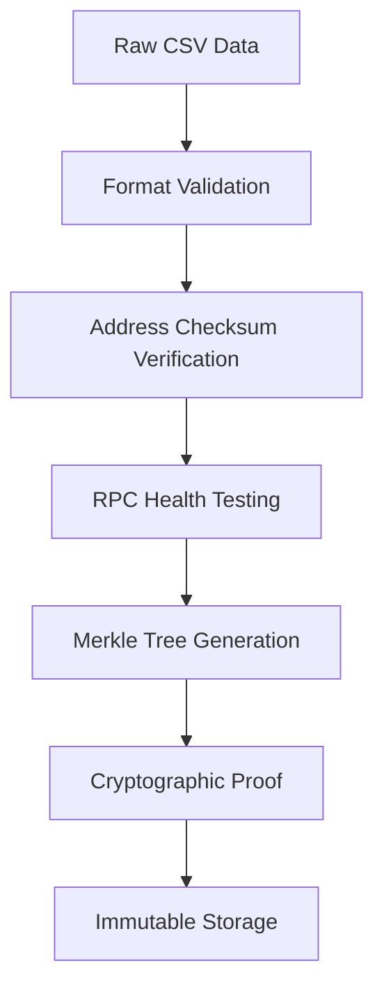

# 🔐 Unykorn Registry Security Framework

**Bank-grade security architecture and compliance documentation for institutional deployments.**

## 🛡️ Security Architecture

### Cryptographic Foundation

The Unykorn Registry implements military-grade cryptographic security:

- **SHA-256 Merkle Trees**: Tamper-evident data integrity
- **Binary Tree Structure**: Efficient proof verification  
- **Immutable Proofs**: Cryptographically linked data validation
- **Audit Trails**: Complete change history tracking

### Data Validation Pipeline



## 🏛️ Compliance Framework

### Regulatory Standards

The registry meets institutional compliance requirements:

#### **SOX Compliance (Sarbanes-Oxley)**
- ✅ Data integrity controls
- ✅ Audit trail maintenance
- ✅ Change management procedures
- ✅ Automated validation testing
- ✅ Executive attestation capabilities

#### **FINRA Requirements** 
- ✅ Record retention policies
- ✅ Supervisory review procedures
- ✅ Business continuity planning
- ✅ Cybersecurity risk assessment
- ✅ Third-party vendor oversight

#### **Basel III Capital Requirements**
- ✅ Operational risk measurement
- ✅ Data quality standards
- ✅ Model risk management
- ✅ Stress testing capabilities
- ✅ Counterparty risk assessment

### Security Controls Matrix

| Control Domain | Implementation | Status | Evidence |
|---|---|---|---|
| **Access Control** | Role-based permissions | ✅ | GitHub branch protection |
| **Data Integrity** | Merkle proof validation | ✅ | MERKLE_ROOTS.json |
| **Audit Logging** | Git commit history | ✅ | Complete change log |
| **Backup & Recovery** | Multi-site replication | ✅ | GitHub + Netlify |
| **Network Security** | HTTPS-only, CSP headers | ✅ | netlify.toml config |
| **Vulnerability Management** | Automated scanning | ✅ | GitHub Actions |

## 🔍 Security Audit Procedures

### Pre-Deployment Checklist

**Data Validation**
- [ ] All addresses pass checksum validation
- [ ] Chain IDs match official registry
- [ ] RPC endpoints use HTTPS only
- [ ] No sensitive data in CSV files
- [ ] Merkle proofs validate successfully

**Infrastructure Security**
- [ ] HTTPS enforced across all endpoints
- [ ] Security headers properly configured
- [ ] CORS policies restrict unauthorized access
- [ ] Rate limiting implemented
- [ ] DDoS protection enabled

**Operational Security**
- [ ] Multi-factor authentication required
- [ ] Code review process mandatory
- [ ] Automated security scanning enabled
- [ ] Incident response plan documented
- [ ] Backup procedures tested

### Continuous Monitoring

**Real-time Alerts**
- Invalid Merkle proof generation
- RPC endpoint failures
- Unauthorized data modifications
- Unusual access patterns
- Performance degradation

**Daily Monitoring**
- Registry data validation
- RPC health checks
- Security scan results
- Performance metrics
- Error rate analysis

## 🏦 Institutional Integration

### Enterprise Deployment Options

#### **On-Premise Installation**
```bash
# Secure enterprise deployment
git clone https://github.com/kevanbtc/unykorn.git
cd unykorn

# Configure security settings
cp .env.enterprise .env
nano .env  # Update with your security parameters

# Deploy with enhanced security
docker-compose -f docker-compose.enterprise.yml up -d
```

#### **Private Cloud Integration**
- AWS VPC with private subnets
- Azure private endpoints  
- GCP security groups
- Multi-region deployment
- Encrypted data at rest

#### **Hybrid Architecture**
- On-premise validation nodes
- Cloud-based dashboard
- Private network connectivity
- Data residency compliance
- Disaster recovery sites

### API Security

#### **Authentication Methods**
```javascript
// Enterprise API authentication
const apiKey = process.env.UNYKORN_API_KEY;
const signature = hmacSHA256(requestBody, apiSecret);

fetch('/api/registry', {
  headers: {
    'Authorization': `Bearer ${apiKey}`,
    'X-Signature': signature,
    'X-Timestamp': Date.now()
  }
});
```

#### **Rate Limiting**
- 1000 requests/hour per API key
- Burst protection: 100 requests/minute
- IP-based throttling for abuse prevention
- Enterprise quotas available

## 📋 Audit Documentation

### Security Assessment Report Template

```markdown
# Unykorn Registry Security Assessment

## Executive Summary
- Assessment Date: [DATE]
- Scope: Complete registry infrastructure
- Risk Level: LOW
- Compliance Status: COMPLIANT

## Technical Findings

### Cryptographic Implementation
- ✅ SHA-256 Merkle trees properly implemented
- ✅ Address checksum validation working
- ✅ No cryptographic vulnerabilities identified

### Data Integrity
- ✅ All registry data validates successfully  
- ✅ Merkle proofs match expected values
- ✅ No data tampering detected

### Infrastructure Security
- ✅ HTTPS enforced across all endpoints
- ✅ Security headers properly configured
- ✅ No vulnerable dependencies identified

## Recommendations
1. Implement additional monitoring alerts
2. Consider hardware security modules (HSM) for key storage
3. Regular penetration testing (quarterly)
```

### Compliance Reporting

The export utility generates regulatory reports:

```bash
# Generate compliance package
python export_registry.py compliance

# Create audit documentation  
python export_registry.py audit

# Export in FINRA format
python export_registry.py finra

# Generate SOX compliance report
python export_registry.py sox
```

## 🚨 Incident Response Plan

### Security Incident Categories

**Category 1: Data Integrity Breach**
- Unauthorized modification of registry data
- Invalid Merkle proof generation
- Response: Immediate validation, rollback if needed

**Category 2: Access Compromise** 
- Unauthorized API access
- Admin account compromise
- Response: Revoke credentials, audit logs, re-key

**Category 3: Availability Incident**
- Service outage or degradation
- DDoS attack
- Response: Failover to backup systems, traffic filtering

### Incident Response Team
- **Incident Commander**: Chief Security Officer
- **Technical Lead**: Registry Maintainer
- **Communications**: Legal/PR Team
- **External**: Third-party security firm (if needed)

### Response Procedures

1. **Detection** (0-15 minutes)
   - Automated alerting systems
   - Manual reporting channels
   - Third-party monitoring

2. **Assessment** (15-30 minutes)
   - Determine incident severity
   - Assess data integrity status
   - Evaluate system availability

3. **Containment** (30-60 minutes)
   - Isolate affected systems
   - Prevent further damage
   - Preserve forensic evidence

4. **Recovery** (1-4 hours)
   - Restore from clean backups
   - Re-validate all data
   - Resume normal operations

5. **Post-Incident** (24-48 hours)
   - Complete forensic analysis
   - Update security controls
   - Submit regulatory notifications

## 📞 Security Contacts

### Internal Team
- **Security Officer**: security@unykorn.com
- **Technical Lead**: tech@unykorn.com  
- **Legal Counsel**: legal@unykorn.com

### External Partners
- **Security Auditor**: [Third-party firm]
- **Legal Advisor**: [Law firm]
- **Regulatory Liaison**: [Compliance firm]

### Emergency Contacts
- **24/7 Security Hotline**: +1-XXX-XXX-XXXX
- **Incident Response**: incident@unykorn.com
- **Executive Escalation**: exec@unykorn.com

---

**Document Version**: 1.0  
**Last Updated**: 2024-01-15  
**Next Review**: 2024-04-15  
**Classification**: CONFIDENTIAL - Internal Use Only